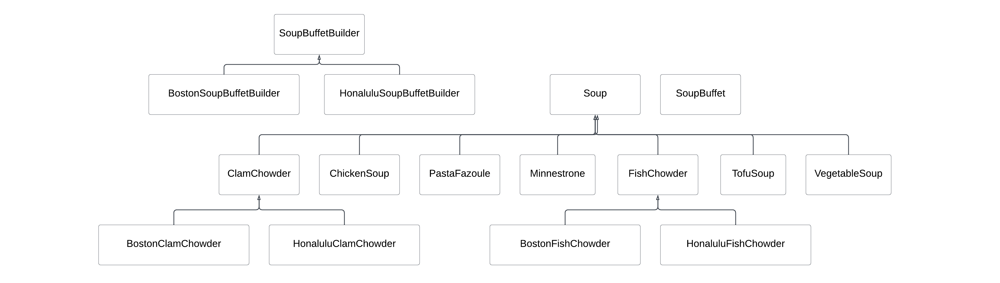
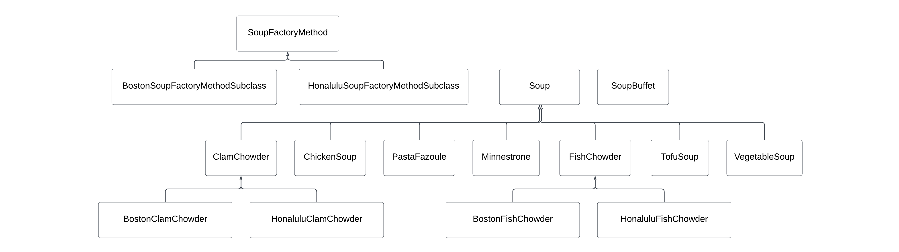
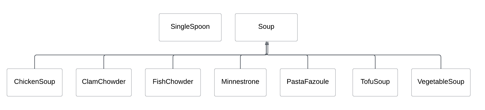
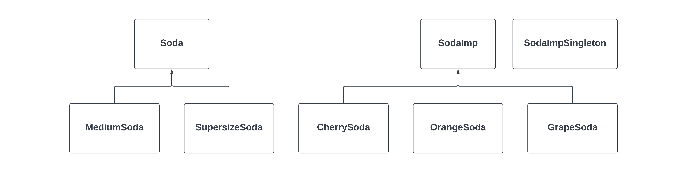

# Design Patterns

A design pattern is a generic solution to a recurring design problem.   Design patterns seek to solve common programming problems with a few common solutions:

- **Encapsulation**: Hiding implementation components in a layer below what the client can access.
- **Subclassing**: Making a "wrapper" that implements something else to reduce repetition.
- **Iteration**: The object does traversals to access all members of a collection.
- **Exceptions**: Errors in one part of the code should be handled elsewhere, so the language is structured for throwing and catching exceptions.
- **Generics**: Generic types allow users to use objects of any type in data structures.

SOLID Design Principles:

- **Single Responsibility Principle**: A class should have only one responsibility.
- **Open-Closed Principle**: A class's behavior can be extended without modifying it.
- **Liscov Substitution Principle**: The derived classes must be substitutable for their base classes.
- **Interface Segregation Principle**: Many client-specific interfaces are better than one general-purpose interface.
- **Dependency Inversion Principle**: Implementation should depend on abstractions, not concrete implementations.

Design patterns do not solve all design problems, but they can increase code clarity and improve modularity.  There are three different kinds of design patterns: creational patterns, structural patterns, and behavioral patterns.  Before we can go into detail about definitions, uses, and examples of each design pattern, UML diagrams need discussion.  These give context to code structures and will be used in code examples.

## Unified Modeling Language (UML)

UML class diagrams show classes and their relationships, including inheritance and composition, attributes, and operations.  Additionally, UML sequence diagrams can show the dynamics of a system.  UML is the standard "language" of object-oriented modeling and design.
Here is some UML notation:

- Boxes are classes
- Heads on arrows denote inheritance with subclasses pointing to superclasses
- *Italics* denote abstract types
- Dotted lines between classes denote interface inheritance

UML associations often represent a composition relationship; objects of one class enclose objects of another.  Thus, UML is often used to model abstract concepts and their relationships.  Attributes and associations correspond to ADT operations.  UML can express designs - there is a close correspondence to implementation.  Attributes and associates correspond to representation fields.

## Creational Patterns

### Abstract Factory

The **Abstract Factory** pattern provides an interface for creating families of related or dependent objects without specifying their concrete classes.  For example, the `AbstractSoupFactory` defines the method names and return types to make various kinds of soup.

The `BostonConcreteSoupFactory` and the `HonoluluConcreteSoupFactory` both extend the `AbstractSoupFactory`.

An object can be defined as an `AbstractSoupFactory` and instantiated as either a `BostonConcreteSoupFactory` (BCSF) or a `HonoluluConcreteSoupFactory` (HCSF).  Both BCSF or HCSF have the `makeFishChowder` method, and both return a `FishChowder` type class.  However, the BCSF returns a `FishChowder` subclass of `BostonFishChowder`, while the HCSF returns a `FishChowder` subclass of HonoluluFishChowder.  

Code for all three classes is featured below, starting with the `AbstractSoupFactory`:

    abstract class AbstractSoupFactory {
        String factoryLocation;
        public String getFactoryLocation() {
            return factoryLocation;
        }
     
        public ChickenSoup makeChickenSoup() {
            return new ChickenSoup();
        }
        public ClamChowder makeClamChowder() {
            return new ClamChowder();
        }
        public FishChowder makeFishChowder() {
            return new FishChowder();
        }    
        public Minnestrone makeMinnestrone() {
            return new Minnestrone();
        }
        public PastaFazul makePastaFazul() {
            return new PastaFazul();
        }
        public TofuSoup makeTofuSoup() {
            return new TofuSoup();
        }
        public VegetableSoup makeVegetableSoup() {
            return new VegetableSoup();
        }
    }

BCSF and HCSF are next.  Notice how, in the extended classes, there are different clam and fish chowders:

    class BostonConcreteSoupFactory extends AbstractSoupFactory {
        public BostonConcreteSoupFactory() {
            factoryLocation = "Boston";
        }
        public ClamChowder makeClamChowder() {
            return new BostonClamChowder();
        }
        public FishChowder makeFishChowder() {
            return new BostonFishChowder();
        }
    }

    class BostonClamChowder extends ClamChowder {
        public BostonClamChowder() {
            soupName = "QuahogChowder";
            soupIngredients.clear();     
            soupIngredients.add("1 Pound Fresh Quahogs");
            soupIngredients.add("1 cup corn");    
            soupIngredients.add("1/2 cup heavy cream");
            soupIngredients.add("1/4 cup butter");    
            soupIngredients.add("1/4 cup potato chips");
        }
    }

    class BostonFishChowder extends FishChowder {
        public BostonFishChowder() {
            soupName = "ScrodFishChowder";
            soupIngredients.clear();     
            soupIngredients.add("1 Pound Fresh Scrod");
            soupIngredients.add("1 cup corn");    
            soupIngredients.add("1/2 cup heavy cream");
            soupIngredients.add("1/4 cup butter");    
            soupIngredients.add("1/4 cup potato chips");
        }
    }

    class HonoluluConcreteSoupFactory extends AbstractSoupFactory {
        public HonoluluConcreteSoupFactory() {
            factoryLocation = "Honolulu";
        }
        public ClamChowder makeClamChowder() {
        return new HonoluluClamChowder();
        }
        public FishChowder makeFishChowder() {
        return new HonoluluFishChowder();
        }
    }

    class HonoluluClamChowder extends ClamChowder {
        public HonoluluClamChowder() {
            soupName = "PacificClamChowder";
            soupIngredients.clear();     
            soupIngredients.add("1 Pound Fresh Pacific Clams");
            soupIngredients.add("1 cup pineapple chunks");
            soupIngredients.add("1/2 cup coconut milk");
            soupIngredients.add("1/4 cup SPAM");
            soupIngredients.add("1/4 cup taro chips");
        }
    }

    class HonoluluFishChowder extends FishChowder {
        public HonoluluFishChowder() {
            soupName = "OpakapakaFishChowder";
            soupIngredients.clear();
            soupIngredients.add("1 Pound Fresh Opakapaka Fish");
            soupIngredients.add("1 cup pineapple chunks");
            soupIngredients.add("1/2 cup coconut milk");
            soupIngredients.add("1/4 cup SPAM");
            soupIngredients.add("1/4 cup taro chips");
        }
    }

The UML diagram for this `AbstractSoupFactory` system is pictured below:

### Builder

The **Builder** pattern separates the construction of a complex object from its representation so that the same construction process can create different representations.  In this example, the abstract `SoupBuffetBuilder` defines the methods necessary to create a `SoupBuffet`.

`BostonSoupBuffetBuilder` and the `HonoluluSoupBuffetBuilder` both extend the `SoupBuffetBuilder`.

An object can be defined as an `SoupBuffetBuilder` and instantiated as either a `BostonSoupBuffetBuilder` (BSBB) or a `HonoluluSoupBuffetBuilder` (HSBB).  BSBB and HSBB both have a `buildFishChowder` method, and both return a `FishChowder` type class.  However, the BSBB returns a `FishChowder` subclass of `BostonFishChowder`, while the HSBB returns a `FishChowder` subclass of `HonoluluFishChowder`.
Code for all three classes is featured below, starting with `SoupBuffetBuilder`:

    abstract class SoupBuffetBuilder {
        SoupBuffet soupBuffet;
         
        public SoupBuffet getSoupBuffet() {
            return soupBuffet;
        }
     
        public void buildSoupBuffet() {
            soupBuffet = new SoupBuffet();
        }
     
        public abstract void setSoupBuffetName();
         
        public void buildChickenSoup() {
            soupBuffet.chickenSoup = new ChickenSoup();
        }
        public void buildClamChowder() {
            soupBuffet.clamChowder = new ClamChowder();
        }
        public void buildFishChowder() {
            soupBuffet.fishChowder = new FishChowder();
        }
        public void buildMinnestrone() {
            soupBuffet.minnestrone = new Minnestrone();
        }
        public void buildPastaFazul() {
            soupBuffet.pastaFazul = new PastaFazul();
        }
        public void buildTofuSoup() {
            soupBuffet.tofuSoup = new TofuSoup();
        }
        public void buildVegetableSoup() {
            soupBuffet.vegetableSoup = new VegetableSoup();
        }
    }

    class BostonSoupBuffetBuilder extends SoupBuffetBuilder {
        public void buildClamChowder() {
        soupBuffet.clamChowder = new BostonClamChowder();
        }
        public void buildFishChowder() {
        soupBuffet.fishChowder = new BostonFishChowder();
        }    
     
        public void setSoupBuffetName() {
        soupBuffet.soupBuffetName = "Boston Soup Buffet";
        }
    }

    class BostonClamChowder extends ClamChowder {
        public BostonClamChowder() {
            soupName = "QuahogChowder";
            soupIngredients.clear();     
            soupIngredients.add("1 Pound Fresh Quahogs");
            soupIngredients.add("1 cup corn");    
            soupIngredients.add("1/2 cup heavy cream");
            soupIngredients.add("1/4 cup butter");    
            soupIngredients.add("1/4 cup potato chips");
        }
    }

    class BostonFishChowder extends FishChowder {
        public BostonFishChowder() {
            soupName = "ScrodFishChowder";
            soupIngredients.clear();     
            soupIngredients.add("1 Pound Fresh Scrod");
            soupIngredients.add("1 cup corn");    
            soupIngredients.add("1/2 cup heavy cream");
            soupIngredients.add("1/4 cup butter");    
            soupIngredients.add("1/4 cup potato chips");
        }
    }

    class HonoluluSoupBuffetBuilder extends SoupBuffetBuilder {
        public void buildClamChowder() {
            soupBuffet.clamChowder = new HonoluluClamChowder();
        }
        public void buildFishChowder() {
            soupBuffet.fishChowder = new HonoluluFishChowder();
        }
     
        public void setSoupBuffetName() {
            soupBuffet.soupBuffetName = "Honolulu Soup Buffet";
        }
    }

    class HonoluluClamChowder extends ClamChowder {
        public HonoluluClamChowder() {
            soupName = "PacificClamChowder";
            soupIngredients.clear();     
            soupIngredients.add("1 Pound Fresh Pacific Clams");
            soupIngredients.add("1 cup pineapple chunks");
            soupIngredients.add("1/2 cup coconut milk");
            soupIngredients.add("1/4 cup SPAM");    
            soupIngredients.add("1/4 cup taro chips");
        }
    }

    class HonoluluFishChowder extends FishChowder {
        public HonoluluFishChowder() {
            soupName = "OpakapakaFishChowder";
            soupIngredients.clear();     
            soupIngredients.add("1 Pound Fresh Opakapaka Fish");
            soupIngredients.add("1 cup pineapple chunks");
            soupIngredients.add("1/2 cup coconut milk");
            soupIngredients.add("1/4 cup SPAM");    
            soupIngredients.add("1/4 cup taro chips");
        }
    }

We have also included the `Soup.java` and `SoupBuffer.java` helper class to supplement the classes we already have:

    import java.util.ArrayList;
    import java.util.ListIterator;

    abstract class Soup
    {
    ArrayList soupIngredients = new ArrayList();    
    String soupName;
     
    public String getSoupName()
    {
        return soupName;
    }
     
    public String toString()
    {
            StringBuffer stringOfIngredients = new StringBuffer(soupName);
            stringOfIngredients.append(" Ingredients: ");
            ListIterator soupIterator = soupIngredients.listIterator();
            while (soupIterator.hasNext())
            {
                stringOfIngredients.append((String)soupIterator.next());
            }
            return stringOfIngredients.toString();
    }
    }        

    class ChickenSoup extends Soup
    {
        public ChickenSoup()
        {
            soupName = "ChickenSoup";
            soupIngredients.add("1 Pound diced chicken");
            soupIngredients.add("1/2 cup rice");    
            soupIngredients.add("1 cup bullion");    
            soupIngredients.add("1/16 cup butter");    
            soupIngredients.add("1/4 cup diced carrots");        
        }
    }   

    class ClamChowder extends Soup
    {
        public ClamChowder()
        {
            soupName = "ClamChowder";
            soupIngredients.add("1 Pound Fresh Clams");
            soupIngredients.add("1 cup fruit or vegetables");    
            soupIngredients.add("1/2 cup milk");     
            soupIngredients.add("1/4 cup butter");    
            soupIngredients.add("1/4 cup chips");        
        }
    }

    class FishChowder extends Soup
    {
        public FishChowder()
        {
            soupName = "FishChowder";
            soupIngredients.add("1 Pound Fresh fish");
            soupIngredients.add("1 cup fruit or vegetables");    
            soupIngredients.add("1/2 cup milk");     
            soupIngredients.add("1/4 cup butter");    
            soupIngredients.add("1/4 cup chips");        
        }
    }

    class Minnestrone extends Soup
    {
        public Minnestrone()
        {
            soupName = "Minestrone";
            soupIngredients.add("1 Pound tomatos");
            soupIngredients.add("1/2 cup pasta");    
            soupIngredients.add("1 cup tomato juice");           
        }
    }

    class PastaFazul extends Soup
    {
        public PastaFazul()
        {
            soupName = "Pasta Fazul";
            soupIngredients.add("1 Pound tomatos");
            soupIngredients.add("1/2 cup pasta");    
            soupIngredients.add("1/2 cup diced carrots");        
            soupIngredients.add("1 cup tomato juice");           
        }
    }

    class TofuSoup extends Soup
    {
        public TofuSoup()
        {
            soupName = "Tofu Soup";
            soupIngredients.add("1 Pound tofu");
            soupIngredients.add("1 cup carrot juice");    
            soupIngredients.add("1/4 cup spirolena");        
        }
    }

    class VegetableSoup extends Soup
    {
        public VegetableSoup()
        {
            soupName = "Vegetable Soup";
            soupIngredients.add("1 cup bullion");    
            soupIngredients.add("1/4 cup carrots");      
            soupIngredients.add("1/4 cup potatoes");         
        }
    }

    class SoupBuffet {
    String soupBuffetName;
     
    ChickenSoup chickenSoup;
    ClamChowder clamChowder;
    FishChowder fishChowder;
    Minnestrone minnestrone;
    PastaFazul pastaFazul;
    TofuSoup tofuSoup;
    VegetableSoup vegetableSoup;

    public String getSoupBuffetName() {
        return soupBuffetName;
    }
    public void setSoupBuffetName(String soupBuffetNameIn) {
        soupBuffetName = soupBuffetNameIn;
    }
     
    public void setChickenSoup(ChickenSoup chickenSoupIn) {
        chickenSoup = chickenSoupIn;
    }
    public void setClamChowder(ClamChowder clamChowderIn) {
        clamChowder = clamChowderIn;
    }
    public void setFishChowder(FishChowder fishChowderIn) {
        fishChowder = fishChowderIn;
    }
    public void setMinnestrone(Minnestrone minnestroneIn) {
        minnestrone = minnestroneIn;
    }
    public void setPastaFazul(PastaFazul pastaFazulIn) {
        pastaFazul = pastaFazulIn;
    }
    public void setTofuSoup(TofuSoup tofuSoupIn) {
        tofuSoup = tofuSoupIn;
    }
    public void setVegetableSoup(VegetableSoup vegetableSoupIn) {
        vegetableSoup = vegetableSoupIn;
    }
     
    public String getTodaysSoups() {
            StringBuffer stringOfSoups = new StringBuffer();
            stringOfSoups.append(" Today's Soups!  ");
            stringOfSoups.append(" Chicken Soup: ");     
            stringOfSoups.append(this.chickenSoup.getSoupName());
            stringOfSoups.append(" Clam Chowder: ");     
            stringOfSoups.append(this.clamChowder.getSoupName());
            stringOfSoups.append(" Fish Chowder: ");     
            stringOfSoups.append(this.fishChowder.getSoupName());
            stringOfSoups.append(" Minnestrone: ");      
            stringOfSoups.append(this.minestrone.getSoupName());
            stringOfSoups.append(" Pasta Fazul: ");      
            stringOfSoups.append(this.pastaFazul.getSoupName());
            stringOfSoups.append(" Tofu Soup: ");        
            stringOfSoups.append(this.tofuSoup.getSoupName());
            stringOfSoups.append(" Vegetable Soup: ");       
            stringOfSoups.append(this.vegetableSoup.getSoupName());
            return stringOfSoups.toString();         
    }
    }  

The UML diagram for this `SoupBuffetBuilder` system is pictured below:

### Factory Method
The **Factory** pattern defines an interface for creating an object, but lets subclasses decide which class to instantiate.  The factory method lets a class defer instantiation to subclasses.

For example, the `SoupFactoryMethod` defines the `makeSoupBuffet` method, which returns a `SoupBuffet` object.  The `SoupFactoryMethod` also defines the methods needed in creating the `SoupBuffet`.

The `BostonSoupFactoryMethodSubclass` and the `HonoluluSoupFactoryMethodSubclass` both extend the `SoupFactoryMethod`.  An object can be defined as an `SoupFactoryMethod` and instantiated as either a `BostonSoupFactoryMethodSubclass` (BSFMS) or a `HonoluluSoupFactoryMethodSubclass` (HSFMS).

Both BSFMS and HSFMS override `SoupFactoryMethod`'s `makeFishChowder` method.  The BSFMS returns a `SoupBuffet` with a `FishChowder` subclass of `BostonFishChowder`, while the HSFMS returns a `SoupBuffet` with a `FishChowder` subclass of `HonoluluFishChowder`.

Example code for all the classes in the soup factory system is featured below:

    class SoupFactoryMethod {
        public SoupFactoryMethod() {}
         
        public SoupBuffet makeSoupBuffet() {
            return new SoupBuffet();
        }

        public ChickenSoup makeChickenSoup() {
            return new ChickenSoup();
        }
        public ClamChowder makeClamChowder() {
            return new ClamChowder();
        }
        public FishChowder makeFishChowder() {
            return new FishChowder();
        }
        public Minnestrone makeMinnestrone() {
            return new Minnestrone();
        }
        public PastaFazul makePastaFazul() {
            return new PastaFazul();
        }
        public TofuSoup makeTofuSoup() {
            return new TofuSoup();
        }
        public VegetableSoup makeVegetableSoup() {
            return new VegetableSoup();
        }

        public String makeBuffetName() {
            return "Soup Buffet";
        }
    }

    class BostonSoupFactoryMethodSubclass extends SoupFactoryMethod {
        public String makeBuffetName() {
            return "Boston Soup Buffet";
        }
        public ClamChowder makeClamChowder() {
            return new BostonClamChowder();
        }
        public FishChowder makeFishChowder() {
            return new BostonFishChowder();
        }
    }

    class BostonClamChowder extends ClamChowder {
        public BostonClamChowder() {
            soupName = "QuahogChowder";
            soupIngredients.clear();     
            soupIngredients.add("1 Pound Fresh Quahogs");
            soupIngredients.add("1 cup corn");    
            soupIngredients.add("1/2 cup heavy cream");
            soupIngredients.add("1/4 cup butter");    
            soupIngredients.add("1/4 cup potato chips");
        }
    }

    class BostonFishChowder extends FishChowder {
        public BostonFishChowder() {
            soupName = "ScrodFishChowder";
            soupIngredients.clear();     
            soupIngredients.add("1 Pound Fresh Scrod");
            soupIngredients.add("1 cup corn");
            soupIngredients.add("1/2 cup heavy cream");
            soupIngredients.add("1/4 cup butter");
            soupIngredients.add("1/4 cup potato chips");
        }
    }

Featured below is the code for some additional subclasses:

    class HonoluluSoupFactoryMethodSubclass extends SoupFactoryMethod {
        public String makeBuffetName() {
            return "Honolulu Soup Buffet";
        }
        public ClamChowder makeClamChowder() {
            return new HonoluluClamChowder();
        }
        public FishChowder makeFishChowder() {
            return new HonoluluFishChowder();
        }
    }

    class HonoluluClamChowder extends ClamChowder {
        public HonoluluClamChowder() {
            soupName = "PacificClamChowder";
            soupIngredients.clear();     
            soupIngredients.add("1 Pound Fresh Pacific Clams");
            soupIngredients.add("1 cup pineapple chunks");    
            soupIngredients.add("1/2 cup coconut milk");     
            soupIngredients.add("1/4 cup SPAM");    
            soupIngredients.add("1/4 cup taro chips");       
        }
    }

    class HonoluluFishChowder extends FishChowder {
        public HonoluluFishChowder() {
            soupName = "OpakapakaFishChowder";
            soupIngredients.clear();     
            soupIngredients.add("1 Pound Fresh Opakapaka Fish");
            soupIngredients.add("1 cup pineapple chunks");    
            soupIngredients.add("1/2 cup coconut milk");     
            soupIngredients.add("1/4 cup SPAM");    
            soupIngredients.add("1/4 cup taro chips");       
        }
    }

This factory method example also uses the `Soup.java` subclass.  Pictured below is the UML diagram for the factory system:

### Prototype

With the **Prototype** pattern, developers can specify the kinds of objects to create using a prototypical instance and create new objects by copying this prototype.  In other words, new objects can be created by cloning prototypical objects.
For example, there are several prototype objects (`AbstractSpoon.java`, `AbstractFork.java`) and a factory object that make up this system:

    public class PrototypeFactory {  
        AbstractSpoon prototypeSpoon;
        AbstractFork prototypeFork;
        
        public PrototypeFactory(AbstractSpoon spoon, AbstractFork fork) {
        prototypeSpoon = spoon;
        prototypeFork = fork;
       }
        
       public AbstractSpoon makeSpoon() {
        return (AbstractSpoon)prototypeSpoon.clone();
       }
       public AbstractFork makeFork() {
        return (AbstractFork)prototypeFork.clone();
       }
    }

Concrete prototype objects (`SoupSpoon.java`, `SaladSpoon.java`, `SaladFork.java`) that extend the abstract prototypes are featured below:

    public class SoupSpoon extends AbstractSpoon {  
       public SoupSpoon() {
        setSpoonName("Soup Spoon");
       }
    }

    public class SaladSpoon extends AbstractSpoon {  
       public SaladSpoon() {
        setSpoonName("Salad Spoon");     
       }
    }

    public class SaladFork extends AbstractFork {  
       public SaladFork() {
        setForkName("Salad Fork");
       }
    }

Notice how these classes are all minimal compared to the abstract classes they extend.  The difference in scale is a symptom of modularity and inheritance, and keeps code readable and organized.  The UML for this prototype example follows:

### Singleton

The **Singleton** design pattern ensures that a class only has one instance and provides a global point of access to it.

For example, the `SingleSpoon` class holds one instance of `SingleSpoon in private static SingleSpoon theSpoon;`.  The `SingleSpoon` class determines the spoons availability using `private static boolean theSpoonIsAvailable = true;`.  The first time `SingleSpoon.getTheSpoon()` is called, it creates an instance of a `SingleSpoon`.  The `SingleSpoon` cannot be distributed again until it is returned with `SingleSpoon.returnTheSpoon()`.

If a developer were to create a spoon "pool," they would have the same basic logic as shown.  However, multiple spoons would be distributed.  The variable `theSpoon` would hold an array or collection of spoons.  The variable `theSpoonIsAvaialable` would become a counter of the number of available spoons.

Please also note that this example \textit{is not thread-safe}.  The `getTheSpoon()` method should be synchronized to make it thread-safe.
Example code is shown below:

    public class SingleSpoon
    {  
       private Soup soupLastUsedWith;
       
       private static SingleSpoon theSpoon;
       private static boolean theSpoonIsAvailable = true;
       
       private SingleSpoon() {}
         
       public static SingleSpoon getTheSpoon() {
        if (theSpoonIsAvailable) {
            if (theSpoon == null) {
                theSpoon = new SingleSpoon();
            }
            theSpoonIsAvailable = false;
            return theSpoon;
        } else {
            return null;
            //spoon not available,
            //  could throw an error or return null (as shown)
        }
       }
        
       public String toString() {
        return "Behold the glorious single spoon!";
       }
        
       public static void returnTheSpoon() {
        theSpoon.cleanSpoon();
        theSpoonIsAvailable = true;
       }     
       
       public Soup getSoupLastUsedWith() {
        return this.soupLastUsedWith;
       }
       public void setSoupLastUsedWith(Soup soup) {
        this.soupLastUsedWith = soup;
       }

       public void cleanSpoon() {
        this.setSoupLastUsedWith(null);
       }   
    }

The UML diagram for this example is featured below:

## Structural Patterns

### Adapter

With the **Adapter** design pattern, developers convert the interface of a class into another interface that clients expect.  An adapter lets classes work together that otherwise could not because of incompatible interfaces.

For example, the `TeaBall` class takes in an instance of `LooseLeafTea`.  The `TeaBall` class uses the `steepTea` method from `LooseLeafTea` and adapts it to provide the `steepTeaInCup` method, which the `TeaCup` class requires.  See `TeaBag.java` below:

    public class TeaBag {  
       boolean teaBagIsSteeped;
        
       public TeaBag() {
        teaBagIsSteeped = false;
       }
       
       public void steepTeaInCup() {
        teaBagIsSteeped = true;
        System.out.println("tea bag is steeping in cup");
       }
    }

Next, we have an adapter object that creates an interface for the adaptee.  See `TeaBall.java` below:

    public class TeaBall extends TeaBag {  
       LooseLeafTea looseLeafTea;
       
       public TeaBall(LooseLeafTea looseLeafTeaIn) {
        looseLeafTea = looseLeafTeaIn;
        teaBagIsSteeped = looseLeafTea.teaIsSteeped;
       }
        
       public void steepTeaInCup() {
        looseLeafTea.steepTea();
        teaBagIsSteeped = true;
       }
    }

Code for the adaptee object, `LooseLeafTea.java`, is below:

    public class LooseLeafTea {  
       boolean teaIsSteeped;
        
       public LooseLeafTea() {
        teaIsSteeped = false;
       }
       
       public void steepTea() {
        teaIsSteeped = true;
        System.out.println("tea is steeping");
       }
    }

Finally, the `TeaCup.java` class accepts the adapter and adaptee to allow users to steep tea bags, as well as tea balls, is featured below:

    public class TeaCup {  
       public void steepTeaBag(TeaBag teaBag) {
        teaBag.steepTeaInCup();
       }
    }

Notice how the root class is uncomplicated and has exactly as many extensions as the functionality requires.  Thus, the Singleton pattern shows why we use design patterns: they make life easier.  The UML diagram for this example is shown below:

### Bridge

The **Bridge** pattern decouples an abstraction from its implementation so that the two can vary independently.  The UML diagram below illustrates the Bridge structure well:

Notice how the abstract soda class and the actual soda implementation are distinctly separated.  The code abstract `Soda.java` class, along with its abstract extending classes `MediumSoda.java` and `SuperSizeSoda.java`, is featured below:

    public abstract class Soda {  
       SodaImp sodaImp;
       
       public void setSodaImp() {
        this.sodaImp = SodaImpSingleton.getTheSodaImp();
       }
       public SodaImp getSodaImp() {
        return this.sodaImp;
       }
       
       public abstract void pourSoda();
    }

    public class MediumSoda extends Soda {  
       public MediumSoda() {
        setSodaImp();
       }
       
       public void pourSoda() {
        SodaImp sodaImp = this.getSodaImp();
        for (int i = 0; i < 2; i++) {
            System.out.print("...glug...");
            sodaImp.pourSodaImp();
        }
        System.out.println(" ");
       }
    }

    public class SuperSizeSoda extends Soda {  
       public SuperSizeSoda() {
        setSodaImp();
       }
       
       public void pourSoda() {
        SodaImp sodaImp = this.getSodaImp();
        for (int i = 0; i < 5; i++) {
            System.out.print("...glug...");
            sodaImp.pourSodaImp();
        }
        System.out.println(" ");     
       }
    }

The very small `SodaImp.java` class connects these abstract classes to a concrete object, and `CherrySodaImp.java`, `GrapeSodaImp.java`, `OrangeSodaImp.java` all extend the concrete "bridge" so there are several different, fleshed out, compatible objects to work with.  There is also an additional Singleton class `SodaImpSingleton.java` to keep all instances clear:

    public abstract class SodaImp {  
       public abstract void pourSodaImp();
    }

    public class CherrySodaImp extends SodaImp {
       CherrySodaImp() {}
        
       public void pourSodaImp() {
        System.out.println("Yummy Cherry Soda!");
       }
    }

    public class GrapeSodaImp extends SodaImp {
       GrapeSodaImp() {}
        
       public void pourSodaImp() {
        System.out.println("Delicious Grape Soda!");
       }
    }

    public class OrangeSodaImp extends SodaImp {  
       OrangeSodaImp() {}
        
       public void pourSodaImp() {
        System.out.println("Citrusy Orange Soda!");
       }
    }

    public class SodaImpSingleton {  
        private static SodaImp sodaImp;
       
        public SodaImpSingleton(SodaImp sodaImpIn) {
            this.sodaImp = sodaImpIn;
        }
        
        public static SodaImp getTheSodaImp() {
            return sodaImp;
        }
    }

### Composite

The **Composite** design pattern allows developers to compose objects into tree structures to represent part-whole hierarchies.  Composite lets clients treat individual objects and compositions of objects uniformly by assembling groups of objects with the same signature.  Consider the `TeaBags.java` example once again, with the composite of all tea bags being `TinOfTeaBags.java`:

    import java.util.LinkedList;
    import java.util.ListIterator;

    public abstract class TeaBags {  
       LinkedList teaBagList;
       TeaBags parent;
       String name;
        
       public abstract int countTeaBags();
       
       public abstract boolean add(TeaBags teaBagsToAdd);
       public abstract boolean remove(TeaBags teaBagsToRemove);
       public abstract ListIterator createListIterator();
       
       public void setParent(TeaBags parentIn) {
        parent = parentIn;
       }
       public TeaBags getParent() {
        return parent;
       }
       
       public void setName(String nameIn) {
        name = nameIn;
       }
       public String getName() {
        return name;
       }
    }

    public class OneTeaBag extends TeaBags {
        public OneTeaBag(String nameIn) {
            this.setName(nameIn);
        }
        
        public int countTeaBags() {
            return 1;
        }
       
        public boolean add(TeaBags teaBagsToAdd) {
            return false;
        }
        public boolean remove(TeaBags teaBagsToRemove) {
            return false;
        }
        public ListIterator createListIterator() {
            return null;
        }
    }

    public class TinOfTeaBags extends TeaBags {  
       public TinOfTeaBags(String nameIn) {
        teaBagList = new LinkedList();
        this.setName(nameIn);
       }
       
       public int countTeaBags() {
        int totalTeaBags = 0;
        ListIterator listIterator = this.createListIterator();
        TeaBags tempTeaBags;
        while (listIterator.hasNext()) {
            tempTeaBags = (TeaBags)listIterator.next();
            totalTeaBags += tempTeaBags.countTeaBags();
        }
        return totalTeaBags;
       }
       
       public boolean add(TeaBags teaBagsToAdd) {
        teaBagsToAdd.setParent(this);
        return teaBagList.add(teaBagsToAdd);
       }
       
       public boolean remove(TeaBags teaBagsToRemove) {
        ListIterator listIterator =
            this.createListIterator();
        TeaBags tempTeaBags;
        while (listIterator.hasNext()) {
            tempTeaBags = (TeaBags)listIterator.next();
            if (tempTeaBags == teaBagsToRemove) {
                listIterator.remove();
                return true;
            }
        }
        return false;
       }
       
       public ListIterator createListIterator() {
        ListIterator listIterator = teaBagList.listIterator();
        return listIterator;
       }
    }

The UML diagram for this example is pictured below:

### Decorator or Wrapper

The **Decorator**, or **Wrapper** pattern, allows developers to attach additional responsibilities to an object dynamically.  Decorators provide a flexible alternative to subclassing for extending functionality.  A wrapper is a thin layer over an encapsulated class that uses composition/delegation to modify its interface - as we do with `GraphWrapper` in class.  The wrapper extends the behavior of the encapsulated class and restricts access to the encapsulated object.  The encapsulated object (delegate) does most of the work.

For example, a decorator class (`ChaiDecorator.java` here) takes in a delegate class (`TeaLeaves.java` in this case), both of which extend the same abstract class (`Tea.java`) and adds functionality to the delegate.  See the example code below:

    import java.util.ArrayList;
    import java.util.ListIterator;

    public abstract class Tea {  
       boolean teaIsSteeped;
       
       public abstract void steepTea();
    }

    public class ChaiDecorator extends Tea {
        private Tea teaToMakeChai;
        private ArrayList chaiIngredients = new ArrayList();
        
        public ChaiDecorator(Tea teaToMakeChai) {
            this.addTea(teaToMakeChai);
            chaiIngredients.add("bay leaf");
            chaiIngredients.add("cinnamon stick");
            chaiIngredients.add("ginger");
            chaiIngredients.add("honey");
            chaiIngredients.add("soy milk");
            chaiIngredients.add("vanilla bean");
        }

        private void addTea(Tea teaToMakeChaiIn) {
            this.teaToMakeChai = teaToMakeChaiIn;
        }
        
        public void steepTea() {
            this.steepChai();
        }

        public void steepChai() {
            teaToMakeChai.steepTea();
            this.steepChaiIngredients();
            System.out.println("tea is steeping with chai");
        }    
        
        public void steepChaiIngredients() {
            ListIterator listIterator = chaiIngredients.listIterator();
            while (listIterator.hasNext()) {
                System.out.println(((String)(listIterator.next())) +
                                            " is steeping");
            }
            System.out.println("chai ingredients are steeping");
        }    
    }

    public class TeaLeaves extends Tea {  
       public TeaLeaves() {
        teaIsSteeped = false;
       }
       
       public void steepTea() {
        teaIsSteeped = true;
        System.out.println("tea leaves are steeping");
       }
    }

The UML diagram for this relationship is featured below:

### Facade

In the **Facade** pattern, one class has a method that calls several other classes to achieve complex goals.  The pattern is useful for providing a unified interface to a set of interfaces in a subsystem; a facade defines a higher-level interface that makes the subsystem easier to use.
This design pattern uses no polymorphism, so use this class if extending classes is difficult, impossible, or clunky.

Below are four classes: `FacadeCuppaMaker.java`, the facade in the system, and the three classes it interfaces: `FacadeTeaCup.java`, `FacadeWater.java`, and `FacadeTeaBag.java`.  Take note of the method `FacadeCuppaMaker.java` uses to instantiate all these objects:

    public class FacadeCuppaMaker {  
       boolean teaBagIsSteeped;
        
       public FacadeCuppaMaker() {
        System.out.println(
            "FacadeCuppaMaker ready to make you a cuppa!");
       }
       
       public FacadeTeaCup makeACuppa() {
        FacadeTeaCup cup = new FacadeTeaCup();
        FacadeTeaBag teaBag = new FacadeTeaBag();
        FacadeWater water = new FacadeWater();
        cup.addFacadeTeaBag(teaBag);
        water.boilFacadeWater();
        cup.addFacadeWater(water);
        cup.steepTeaBag();
        return cup;
       }
    }

    public class FacadeTeaCup {  
       boolean teaBagIsSteeped;
       FacadeWater facadeWater;
       FacadeTeaBag facadeTeaBag;
        
       public FacadeTeaCup() {
        setTeaBagIsSteeped(false);
        System.out.println("behold the beautiful new tea cup");
       }    
       
       public void setTeaBagIsSteeped(boolean isTeaBagSteeped) {
        teaBagIsSteeped = isTeaBagSteeped;
       }
       public boolean getTeaBagIsSteeped() {
        return teaBagIsSteeped;
       }
        
       public void addFacadeTeaBag(FacadeTeaBag facadeTeaBagIn) {
        facadeTeaBag = facadeTeaBagIn;
        System.out.println("the tea bag is in the tea cup");
       }
       
       public void addFacadeWater(FacadeWater facadeWaterIn) {
        facadeWater = facadeWaterIn;
        System.out.println("the water is in the tea cup");  
       }   
       
       public void steepTeaBag() {
        if ( (facadeTeaBag != null) &&
                ( (facadeWater != null) &&
                (facadeWater.getWaterIsBoiling()) )
            ) {
            System.out.println("the tea is steeping in the cup");
            setTeaBagIsSteeped(true);
        } else {
            System.out.println("the tea is not steeping in the cup");
            setTeaBagIsSteeped(false);
        }        
       }
       
       public String toString() {
        if (this.getTeaBagIsSteeped()) {
            return ("A nice cuppa tea!");
        } else {
            String tempString = new String("A cup with ");
            if (facadeWater != null) {
                    if (facadeWater.getWaterIsBoiling()) {
                        tempString = (tempString + "boiling water ");
                    } else {
                        tempString = (tempString + "cold water ");
                    }
            } else {
                    tempString = (tempString + "no water ");
            }
     
            if (facadeTeaBag != null) {
                    tempString = (tempString + "and a tea bag");
            } else {
                    tempString = (tempString + "and no tea bag");
            }
            return tempString;
        }
                         
       }
    }

    public class FacadeWater {  
       boolean waterIsBoiling;
        
       public FacadeWater() {
        setWaterIsBoiling(false);
        System.out.println("behold the wonderous water");    
       }
       
       public void boilFacadeWater() {
        setWaterIsBoiling(true);
        System.out.println("water is boiling");
       }
       
       public void setWaterIsBoiling(boolean isWaterBoiling) {
        waterIsBoiling = isWaterBoiling;
       }
       public boolean getWaterIsBoiling() {
        return waterIsBoiling;
       }
    }

    public class FacadeTeaBag {  
       public FacadeTeaBag() {
        System.out.println("behold the lovely tea bag");
       }
    }

A UML diagram detailing the interfacing of these objects is pictured below.  Here, they are all separate classes that do not extend one another, so there are no arrows:

### Flyweight

The **Flyweight** pattern uses sharing to efficiently support large numbers of fine-grained objects.  A class's reusable and variable parts are broken into two classes: the flyweight (`TeaOrder.java`) and the context (`TeaOrderContext java`), to save resources.  This example uses tea and several helper classes to show the relationship between objects:

    public abstract class TeaOrder {  
        public abstract void serveTea(TeaOrderContext teaOrderContext);
    }

    public class TeaOrderContext {  
       int tableNumber;
       
       TeaOrderContext(int tableNumber) {
        this.tableNumber = tableNumber;
       }
       
       public int getTable() {
        return this.tableNumber;
       }
    }

    public class TeaFlavor extends TeaOrder {  
        String teaFlavor;
       
        TeaFlavor(String teaFlavor) {
            this.teaFlavor = teaFlavor;
        }
       
        public String getFlavor() {
            return this.teaFlavor;
        }
       
        public void serveTea(TeaOrderContext teaOrderContext) {
            System.out.println("Serving tea flavor " +
                                teaFlavor +
                            " to table number " +
                                teaOrderContext.getTable());
        }
    }

    public class TeaFlavorFactory {  
       TeaFlavor[] flavors = new TeaFlavor[10];
        //no more than ten flavors can be made
       int teasMade = 0;
       
       public TeaFlavor getTeaFlavor(String flavorToGet) {
        if (teasMade > 0) {
            for (int i = 0; i < teasMade; i++) {
                if (flavorToGet.equals((flavors[i]).getFlavor())) {
                    return flavors[i];
                }
            }
        }
        flavors[teasMade] = new TeaFlavor(flavorToGet);
        return flavors[teasMade++];
       }
       
       public int getTotalTeaFlavorsMade() {return teasMade;}
    }

This example also contains a factory for simplicity.  The UML for this example is exhibited below:

### Proxy

The **Proxy** design pattern provides a surrogate or placeholder for another object to control access to the main class.  The Proxy, here `PotOfTeaProxy.java`, controls the creation of and access to objects in another the subject, here `PotOfTea.java`:

    //PotOfTeaInterface will ensure that the proxy
    //  has the same methods as its real subject
    public interface PotOfTeaInterface {   
       public void pourTea();
    }

    public class PotOfTeaProxy implements PotOfTeaInterface {  
       PotOfTea potOfTea;
        
       public PotOfTeaProxy() {}
       
       public void pourTea() {
        potOfTea = new PotOfTea();
        potOfTea.pourTea();
       }
    }

    public class PotOfTea implements PotOfTeaInterface {  
       public PotOfTea() {
        System.out.println("Making a pot of tea");
       }
       
       public void pourTea() {
        System.out.println("Pouring tea");
       }   
    }

A UML diagram detailing the proxy relationship is below:

## Behavioral Patterns

### Chain of Responsibility

The **Chain of Responsibility** pattern helps developers avoid coupling the sender of a request to its receiver by giving more than one object a chance to handle the request.  Instead, use the pattern to chain the receiving objects together and pass the request along until an object handles it.  A method called in one class will move up a class hierarchy until a method is found that can properly handle the call.
In this example, we use a DvD class hierarchy to illustrate the strata necessary for deploying the Chain of Responsibility:

    public interface TopTitle {  
       public String getTopTitle();
       
       public String getAllCategories();
    }

    public class DvdCategory implements TopTitle {  
       private String category;
       private String topCategoryTitle;
        
       public DvdCategory(String category) {
            this.setCategory(category);
       }    
       
       public void setCategory(String categoryIn) {
        this.category = categoryIn;
       }
       public String getCategory() {
        return this.category;
       }
       public String getAllCategories() {
        return getCategory();
       }
       
       public void setTopCategoryTitle(String topCategoryTitleIn) {
        this.topCategoryTitle = topCategoryTitleIn;
       }
       public String getTopCategoryTitle() {
        return this.topCategoryTitle;
       }
       
       public String getTopTitle() {
        return this.topCategoryTitle;
       }
    }

    public class DvdSubCategory implements TopTitle {  
       private String subCategory;
       private String topSubCategoryTitle;
       private DvdCategory parent;
       
       public DvdSubCategory(DvdCategory dvdCategory, String subCategory) {
            this.setSubCategory(subCategory);
            this.parent = dvdCategory;
       }    
       
       public void setSubCategory(String subCategoryIn) {
        this.subCategory = subCategoryIn;
       }
       public String getSubCategory() {
        return this.subCategory;
       }
       public void setCategory(String categoryIn) {
        parent.setCategory(categoryIn);
       }
       public String getCategory() {
        return parent.getCategory();
       }
       public String getAllCategories() {
        return (getCategory() + "/" + getSubCategory());
       }
       
       public void setTopSubCategoryTitle(String topSubCategoryTitleIn) {
        this.topSubCategoryTitle = topSubCategoryTitleIn;
       }
       public String getTopSubCategoryTitle() {
        return this.topSubCategoryTitle;
       }
       public void setTopCategoryTitle(String topCategoryTitleIn) {
        parent.setTopCategoryTitle(topCategoryTitleIn);
       }
       public String getTopCategoryTitle() {
        return parent.getTopCategoryTitle();
       }
       
       public String getTopTitle() {
        if (null != getTopSubCategoryTitle()) {
            return this.getTopSubCategoryTitle();
        } else {
            System.out.println("no top title in Category/SubCategory " +
                                getAllCategories());
            return parent.getTopTitle();
        }
       }
    }

    public class DvdSubSubCategory implements TopTitle {  
       private String subSubCategory;
       private String topSubSubCategoryTitle;
       private DvdSubCategory parent;
       
       public DvdSubSubCategory(DvdSubCategory dvdSubCategory,
                                String subCategory) {
            this.setSubSubCategory(subCategory);
            this.parent = dvdSubCategory;
       }    
       
       public void setSubSubCategory(String subSubCategoryIn) {
        this.subSubCategory = subSubCategoryIn;
       }
       public String getSubSubCategory() {
        return this.subSubCategory;
       }
       public void setSubCategory(String subCategoryIn) {
        parent.setSubCategory(subCategoryIn);
       }
       public String getSubCategory() {
        return parent.getSubCategory();
       }
       public void setCategory(String categoryIn) {
        parent.setCategory(categoryIn);
       }
       public String getCategory() {
        return parent.getCategory();
       }
       public String getAllCategories() {
        return (getCategory() + "/" +
                getSubCategory() + "/" +
                getSubSubCategory());}   
       
       public void setTopSubSubCategoryTitle(
        String topSubSubCategoryTitleIn) {
        this.topSubSubCategoryTitle = topSubSubCategoryTitleIn;
       }
       public String getTopSubSubCategoryTitle() {
        return this.topSubSubCategoryTitle;
       }
       public void setTopSubCategoryTitle(
        String topSubCategoryTitleIn) {
        parent.setTopSubCategoryTitle(topSubCategoryTitleIn);
       }
       public String getTopSubCategoryTitle() {
        return parent.getTopSubCategoryTitle();
       }
       public void setTopCategoryTitle(String topCategoryTitleIn) {
        parent.setTopCategoryTitle(topCategoryTitleIn);
       }
       public String getTopCategoryTitle() {
        return parent.getTopCategoryTitle();
       }

       public String getTopTitle() {
        if (null != getTopSubSubCategoryTitle()) {
            return this.getTopSubSubCategoryTitle();
        } else {
            System.out.println(
                "no top title in Category/SubCategory/SubSubCategory " +
                getAllCategories());
            return parent.getTopTitle();
        }
       }
    }

The hierarchical structure of these classes and their relationship is well illustrated in the following UML diagram:

### Command Pattern

The **Command Pattern** design pattern encapsulates a request as an object, letting programmers parameterize clients with different requests, queue or log requests, and support undoable operations.  In this pattern, a commanding object encapsulates everything needed to execute a method in a receiver object.
In this example, `CommandAbstract.java` is the commander, and `DvdName.java` is the receiver.

    public abstract class CommandAbstract {
       public abstract void execute();
    }

    public class DvdName {  
       private String titleName;  
        
       public DvdName(String titleName) {
        this.setTitleName(titleName);
       }    
     
       public final void setTitleName(String titleNameIn) {
        this.titleName = titleNameIn;
       }
       public final String getTitleName() {
        return this.titleName;
       }
       
       public void setNameStarsOn() {
        this.setTitleName(this.getTitleName().replace(' ','*'));
       }
       public void setNameStarsOff() {
        this.setTitleName(this.getTitleName().replace('*',' '));
       }   
       
       public String toString() {
        return ("DVD: " + this.getTitleName());
       }
    }

    public class DvdCommandNameStarsOn extends CommandAbstract {
       private DvdName dvdName;  
        
       public DvdCommandNameStarsOn(DvdName dvdNameIn) {
        this.dvdName = dvdNameIn;
       }    
       public void execute() {
        this.dvdName.setNameStarsOn();
       }
    }

    public class DvdCommandNameStarsOff extends CommandAbstract {  
       private DvdName dvdName;  
        
       public DvdCommandNameStarsOff(DvdName dvdNameIn) {
        this.dvdName = dvdNameIn;
       }    
       public void execute() {
        this.dvdName.setNameStarsOff();
       }
    }

A UML diagram detailing this relationship is featured below:

### Interpreter

Given a language, the **Interpreter** pattern defines a representation for its grammar in addition to an interpreter that uses the representation to interpret sentences in the language.  A context defines a macro language and syntax, parsing input into objects which perform the correct operations on behalf of the client.

    import java.util.StringTokenizer;
    import java.util.ArrayList;
    import java.util.ListIterator;

    public class DvdInterpreterClient {  
       DvdInterpreterContext dvdInterpreterContext;
       
       public DvdInterpreterClient(
        DvdInterpreterContext dvdInterpreterContext) {
        this.dvdInterpreterContext = dvdInterpreterContext;
       }
        
       // expression syntax:
       // show title | actor [for actor | title ]
       public String interpret(String expression) {
        StringBuffer result = new StringBuffer("Query Result: ");
         
        String currentToken;
        StringTokenizer expressionTokens =
            new StringTokenizer(expression);
         
        char mainQuery = ' ';
        char subQuery = ' ';
        boolean forUsed = false;
        String searchString = null;
        boolean searchStarted = false;
        boolean searchEnded = false;
         
        while (expressionTokens.hasMoreTokens())
        {
            currentToken = expressionTokens.nextToken();
            if (currentToken.equals("show")) {
                continue;
                //show in all queries, not used
            } else if (currentToken.equals("title")) {
                if (mainQuery == ' ') {
                    mainQuery = 'T';
                } else {
                    if ((subQuery == ' ') && (forUsed)) {
                        subQuery = 'T';
                    }
                }
            } else if (currentToken.equals("actor")) {
                if (mainQuery == ' ') {
                    mainQuery = 'A';
                } else {
                    if ((subQuery == ' ') && (forUsed)) {
                        subQuery = 'A';
                    }
                }
            } else if (currentToken.equals("for")) {
                forUsed = true;
            } else if ((searchString == null) &&
                        (subQuery != ' ') &&
                        (currentToken.startsWith("<"))) {
                    searchString = currentToken;
                    searchStarted = true;
                    if (currentToken.endsWith(">")) {
                        searchEnded = true;
                    }
            } else if ((searchStarted) && (!searchEnded)) {
                searchString = searchString + " " + currentToken;
                if (currentToken.endsWith(">")) {
                    searchEnded = true;
                }
            }
        }

        if (searchString != null) {
            searchString =
                searchString.substring(1,(searchString.length() - 1));
                //remove <>
        }
         
        DvdAbstractExpression abstractExpression;
         
        switch (mainQuery) {
            case 'A' :  {
                switch (subQuery) {
                    case 'T' : {
                        abstractExpression =
                            new DvdActorTitleExpression(searchString);
                        break;
                    }
                    default : {
                        abstractExpression =
                            new DvdActorExpression();
                        break;
                    }
                }
                break;
            }    
            case 'T' : {
                switch (subQuery) {
                    case 'A' : {
                        abstractExpression =
                            new DvdTitleActorExpression(searchString);
                        break;
                    }
                    default : {
                        abstractExpression = new DvdTitleExpression();
                        break;
                    }
                }
                break;
            }            
             
            default : return result.toString();
        }
         
         
        result.append(
            abstractExpression.interpret(dvdInterpreterContext));
         
        return result.toString();
       }
    }

    public class DvdInterpreterContext {
       private ArrayList titles = new ArrayList();
       private ArrayList actors = new ArrayList();
       private ArrayList titlesAndActors = new ArrayList();
       
       public void addTitle(String title) {
        titles.add(title);
       }
       public void addActor(String actor) {
        actors.add(actor);
       }
       public void addTitleAndActor(TitleAndActor titleAndActor) {
        titlesAndActors.add(titleAndActor);
       }
       
       public ArrayList getAllTitles() {
        return titles;
       }
       public ArrayList getAllActors() {
        return actors;
       }
       public ArrayList getActorsForTitle(String titleIn) {
        ArrayList actorsForTitle = new ArrayList();
        TitleAndActor tempTitleAndActor;
        ListIterator titlesAndActorsIterator =
            titlesAndActors.listIterator();
        while (titlesAndActorsIterator.hasNext()) {
            tempTitleAndActor =
                (TitleAndActor)titlesAndActorsIterator.next();
            if (titleIn.equals(tempTitleAndActor.getTitle())) {
                actorsForTitle.add(tempTitleAndActor.getActor());
            }
        }
        return actorsForTitle;
       }
       public ArrayList getTitlesForActor(String actorIn) {
        ArrayList titlesForActor = new ArrayList();
        TitleAndActor tempTitleAndActor;
        ListIterator actorsAndTitlesIterator =
            titlesAndActors.listIterator();
        while (actorsAndTitlesIterator.hasNext()) {
            tempTitleAndActor =
                (TitleAndActor)actorsAndTitlesIterator.next();
            if (actorIn.equals(tempTitleAndActor.getActor())) {
                titlesForActor.add(tempTitleAndActor.getTitle());
            }
        }
        return titlesForActor;
       }   
    }

    public abstract class DvdAbstractExpression {
       public abstract String interpret(
        DvdInterpreterContext dvdInterpreterContext);
    }

    public class DvdActorExpression extends DvdAbstractExpression {  
       public String interpret(DvdInterpreterContext dvdInterpreterContext) {
        ArrayList actors = dvdInterpreterContext.getAllActors();
        ListIterator actorsIterator = actors.listIterator();
        StringBuffer titleBuffer = new StringBuffer("");
        boolean first = true;
        while (actorsIterator.hasNext()) {
            if (!first) {
                titleBuffer.append(", ");
            } else {
                first = false;
            }
            titleBuffer.append((String)actorsIterator.next());
        }
        return titleBuffer.toString();
       }
    }

    public class DvdActorTitleExpression extends DvdAbstractExpression {
       String title;
       
       public DvdActorTitleExpression(String title) {
        this.title = title;
       }
        
       public String interpret(DvdInterpreterContext dvdInterpreterContext) {
        ArrayList actorsAndTitles =
            dvdInterpreterContext.getActorsForTitle(title);
        ListIterator actorsAndTitlesIterator =
            actorsAndTitles.listIterator();
        StringBuffer actorBuffer = new StringBuffer("");
        boolean first = true;
        while (actorsAndTitlesIterator.hasNext()) {
            if (!first) {
                actorBuffer.append(", ");
            } else {
                first = false;
            }
            actorBuffer.append((String)actorsAndTitlesIterator.next());
        }
        return actorBuffer.toString();
       }
    }

    public class DvdTitleExpression extends DvdAbstractExpression {  
       public String interpret(DvdInterpreterContext
                            dvdInterpreterContext) {
        ArrayList titles = dvdInterpreterContext.getAllTitles();
        ListIterator titlesIterator = titles.listIterator();
        StringBuffer titleBuffer = new StringBuffer("");
        boolean first = true;
        while (titlesIterator.hasNext()) {
            if (!first) {
                titleBuffer.append(", ");
            } else {
                first = false;
            }    
            titleBuffer.append((String)titlesIterator.next());
        }
        return titleBuffer.toString();
       }
    }

    public class DvdTitleActorExpression extends DvdAbstractExpression {  
       String title;
       
       public DvdTitleActorExpression(String title) {
        this.title = title;
       }
        
       public String interpret(DvdInterpreterContext dvdInterpreterContext) {
        ArrayList titlesAndActors =
            dvdInterpreterContext.getTitlesForActor(title);
        ListIterator titlesAndActorsIterator =
            titlesAndActors.listIterator();
        StringBuffer titleBuffer = new StringBuffer("");
        boolean first = true;
        while (titlesAndActorsIterator.hasNext()) {
            if (!first) {
                titleBuffer.append(", ");
            } else {
                first = false;
            }
            titleBuffer.append((String)titlesAndActorsIterator.next());
        }
        return titleBuffer.toString();
       }
    }

    public class TitleAndActor {
        private String title;
        private String actor;
        public TitleAndActor(String title, String actor) {
            this.title = title;
            this.actor = actor;
        }
        public String getTitle() {return this.title;}
        public String getActor() {return this.actor;}
    }    

A UML diagram explaining the above diagram in further detail is pictured below:

### Iterator

An **Iterator** provides a way to access the elements of an aggregate object sequentially, without exposing its underlying representation.  Lists and ArrayLists have built-in iterators in Java, whereas more complex data structures might be custom iterators.  Below is a simple example of an iterator in action:

    public interface DvdListIterator {
       public void first();
       public void next();  
       public boolean isDone();
       public String currentItem();
    }

    public class DvdList {  
       private String[] titles;  
       //Yes, it would be easier to do this whole example with ArrayList
       // and ListIterator, but that would not be as much fun   
       private int titleCount;
       //title count is always a real count of titles, but one ahead of
       //itself as a subscript
       private int arraySize;
        
       public DvdList() {
            titles = new String[3];
            //using 3 to demonstrate array expansion more easily,
            //  not for efficiency       
            titleCount = 0;
            arraySize = 3;
       }    
       
       public int count() {
        return titleCount;
       }
       
       public void append(String titleIn) {
        if (titleCount >= arraySize) {
            String[] tempArray = new String[arraySize];
            for (int i = 0; i < arraySize; i++)
            {tempArray[i] = titles[i];}
            titles = null;
            arraySize = arraySize + 3;           
            titles = new String[arraySize];
            for (int i = 0; i < (arraySize - 3); i++) {
                titles[i] = tempArray[i];
            }
        }
        titles[titleCount++] = titleIn;
       }
       
       public void delete(String titleIn) {
        boolean found = false;
        for (int i = 0; i < (titleCount -1); i++) {
            if (found == false) {
                if (titles[i].equals(titleIn)) {
                    found = true;
                    titles[i] = titles[i + 1];
                }
            } else {
                if (i < (titleCount -1)) {
                    titles[i] = titles[i + 1];
                } else {
                    titles[i] = null;
                }
            }
        }
         
        if (found == true) {
            --titleCount;
        }
       }
       
       
       public DvdListIterator createIterator() {
        return new InnerIterator();
       }

This example shows the Concrete Iterator as an inner class.  The Iterator Pattern in the Gang of Four book allows multiple types of iterators for a given list or aggregate class.  This can be accomplished with multiple Iterators in multiple inner classes.  The `createIterator` class would then have multiple variations.

However, this implementation assumes that the developer has a limited number of iterator variants - which is usually the case.  If more flexibility is required in iterator creation, the iterators should not be in inner classes, and perhaps some factory should be employed to create them.

       private class InnerIterator implements DvdListIterator {
        private int currentPosition = 0;
         
        private InnerIterator() {}
         
        public void first() {
            currentPosition = 0;
        }
         
        public void next() {
            if (currentPosition < (titleCount)) {
                ++currentPosition;
            }
        }
         
        public boolean isDone() {
            if (currentPosition >= (titleCount)) {
                return true;
            } else {
                return false;
            }
        }
         
        public String currentItem() {
            return titles[currentPosition];
        }
       }
    }

A UML diagram showing the inner workings of the Iterator pattern is shown below:

### Mediator

A **Mediator** is an object that encapsulates how a set of objects interact.  A mediator promotes loose coupling by keeping objects from explicitly referring to each other, allowing programmers to vary their interaction independently.  Code for a simple example of a mediator in action is shown below:

    public abstract class DvdTitle {  
       private String title;
       
       public void setTitle(String titleIn) {
        this.title = titleIn;
       }
       public String getTitle() {
        return this.title;
       }
    }

    public class DvdLowercaseTitle extends DvdTitle {
       private String LowercaseTitle;
       private DvdMediator dvdMediator;
        
       public DvdLowercaseTitle(String title, DvdMediator dvdMediator) {
        this.setTitle(title);
        resetTitle();
        this.dvdMediator = dvdMediator;
        this.dvdMediator.setLowercase(this);
       }    
       
       public DvdLowercaseTitle(DvdTitle dvdTitle,
                                DvdMediator dvdMediator) {
        this(dvdTitle.getTitle(), dvdMediator);
       }     
       
       public void resetTitle() {
        this.setLowercaseTitle(this.getTitle().toLowerCase());
       }
       public void resetTitle(String title) {
        this.setTitle(title);
        this.resetTitle();
       }
       
       public void setSuperTitleLowercase() {
        this.setTitle(this.getLowercaseTitle());
        dvdMediator.changeTitle(this);
       }
       
       public String getLowercaseTitle() {
        return LowercaseTitle;
       }
       private void setLowercaseTitle(String LowercaseTitle) {
        this.LowercaseTitle = LowercaseTitle;
       }
    }

    public class DvdUpcaseTitle extends DvdTitle {  
       private String upcaseTitle;
       private DvdMediator dvdMediator;
        
       public DvdUpcaseTitle(String title,
                            DvdMediator dvdMediator) {
        this.setTitle(title);
        resetTitle();
        this.dvdMediator = dvdMediator;
        this.dvdMediator.setUpcase(this);
       }    
       
       public DvdUpcaseTitle(DvdTitle dvdTitle,
                            DvdMediator dvdMediator) {
        this(dvdTitle.getTitle(), dvdMediator);
       }     
       
       public void resetTitle() {
        this.setUpcaseTitle(this.getTitle().toUpperCase());
       }
       public void resetTitle(String title) {
        this.setTitle(title);
        this.resetTitle();
       }    
       
       public void setSuperTitleUpcase() {
        this.setTitle(this.getUpcaseTitle());
        dvdMediator.changeTitle(this);       
       }
       
       public String getUpcaseTitle() {
        return upcaseTitle;
       }
       private void setUpcaseTitle(String upcaseTitle) {
        this.upcaseTitle = upcaseTitle;
       }
    }

    public class DvdMediator {
       private DvdUpcaseTitle dvdUpcaseTitle;
       private DvdLowercaseTitle dvdLowercaseTitle;    
       
       public void setUpcase(DvdUpcaseTitle dvdUpcaseTitle) {
        this.dvdUpcaseTitle = dvdUpcaseTitle;
       }
       
       public void setLowercase(DvdLowercaseTitle dvdLowercaseTitle) {
        this.dvdLowercaseTitle = dvdLowercaseTitle;
       }   
       
       public void changeTitle(DvdUpcaseTitle dvdUpcaseTitle) {
        this.dvdLowercaseTitle.resetTitle(dvdUpcaseTitle.getTitle());
       }
       
       public void changeTitle(DvdLowercaseTitle dvdLowercaseTitle) {
        this.dvdUpcaseTitle.resetTitle(dvdLowercaseTitle.getTitle());
       }   
    }

Here is a UML diagram showing how the mediator was used above:

### Memento

A program using the **Memento** pattern captures and externalizes an object's internal state so the object can be restored to this state later, without violating encapsulation; one object stores another object's state.  See the example below for details on a memento in action:

    import java.util.ArrayList;
    import java.util.ListIterator;

    //the originator
    public class DvdDetails {  
       private String titleName;  
       private ArrayList stars;
       private char encodingRegion;
        
       public DvdDetails(String titleName,
                        ArrayList stars,
                        char encodingRegion) {
        this.setTitleName(titleName);
        this.setStars(stars);
        this.setEncodingRegion(encodingRegion);
       }    
     
       private void setTitleName(String titleNameIn) {
        this.titleName = titleNameIn;
       }
       private String getTitleName() {
        return this.titleName;
       }
       
       private void setStars(ArrayList starsIn) {
        this.stars = starsIn;
       }
       public void addStar(String starIn) {
        stars.add(starIn);
       }
       private ArrayList getStars() {
        return this.stars;
       }
       private static String getStarsString(ArrayList starsIn) {
        int count = 0;
        StringBuffer sb = new StringBuffer();
        ListIterator starsIterator = starsIn.listIterator();
        while (starsIterator.hasNext()) {
            if (count++ > 0) {sb.append(", ");}
            sb.append((String) starsIterator.next());
        }
        return sb.toString();
       }
       
       private void setEncodingRegion(char encodingRegionIn) {
        this.encodingRegion = encodingRegionIn;
       }
       private char getEncodingRegion() {
        return this.encodingRegion;
       }  
       
       public String formatDvdDetails() {
        return ("DVD: " + this.getTitleName() +
                ", starring: " + getStarsString(getStars()) +
                ", encoding region: " + this.getEncodingRegion());
       }   
       
       //sets the current state to what DvdMemento has
       public void setDvdMemento(DvdMemento dvdMementoIn) {
        dvdMementoIn.getState();
       }
       //save the current state of DvdDetails in a DvdMemento
       public DvdMemento createDvdMemento() {
        DvdMemento mementoToReturn = new DvdMemento();
        mementoToReturn.setState();
        return mementoToReturn;
       }
       
       //an inner class for the memento
       class DvdMemento {
        private String mementoTitleName;  
        private ArrayList mementoStars;
        private char mementoEncodingRegion;      
         
        //sets DvdMementoData to DvdDetails
        public void setState() {
                //Because String is immutable, we can just set
                //  the DvdMemento Strings to = the DvdDetail Strings.
                mementoTitleName = getTitleName();
                mementoEncodingRegion = getEncodingRegion();
                //However, ArrayLists are not immutable,
                //  so we need to instantiate a new ArrayList.
                mementoStars = new ArrayList(getStars());
        }
        //resets DvdDetails to DvdMementoData
        public void getState() {
                setTitleName(mementoTitleName);
                setStars(mementoStars);
                setEncodingRegion(mementoEncodingRegion);  
        }    
         
        //only useful for testing
        public String showMemento() {
                return ("DVD: " + mementoTitleName +
                        ", starring: " + getStarsString(mementoStars) +
                        ", encoding region: " + mementoEncodingRegion);
        }    
       }
    }

There is no polymorphism in this example, so the UML diagram is irrelevant and will not be included in this example.

### Observer

An **Observer** defines a one-to-many dependency between objects so that when one object changes state, all of its dependencies are notified and updated automatically; an object notifies other objects if it changes.

    import java.util.ArrayList;
    import java.util.ListIterator;

    public class DvdReleaseByCategory {  
       String categoryName;
       ArrayList subscriberList = new ArrayList();
       ArrayList dvdReleaseList = new ArrayList();   
       
       public DvdReleaseByCategory(String categoryNameIn) {
        categoryName = categoryNameIn;
       }
       
       public String getCategoryName() {
        return this.categoryName;
       }
       
       public boolean addSubscriber(DvdSubscriber dvdSubscriber) {
        return subscriberList.add(dvdSubscriber);
       }
       
       public boolean removeSubscriber(DvdSubscriber dvdSubscriber) {
        ListIterator listIterator = subscriberList.listIterator();
        while (listIterator.hasNext()) {
            if (dvdSubscriber == (DvdSubscriber)(listIterator.next())) {
                listIterator.remove();
                return true;
            }
        }
        return false;
       }
       
       public void newDvdRelease(DvdRelease dvdRelease) {
        dvdReleaseList.add(dvdRelease);
        notifySubscribersOfNewDvd(dvdRelease);
       }
       
       public void updateDvd(DvdRelease dvdRelease) {
        boolean dvdUpdated = false;
        DvdRelease tempDvdRelease;
        ListIterator listIterator = dvdReleaseList.listIterator();
        while (listIterator.hasNext()) {
            tempDvdRelease = (DvdRelease)listIterator.next();
            if (dvdRelease.getSerialNumber().
                    equals(tempDvdRelease.getSerialNumber())) {
                listIterator.remove();
                listIterator.add(dvdRelease);
                dvdUpdated = true;
                break;
            }
        }
        if (dvdUpdated == true) {
            notifySubscribersOfUpdate(dvdRelease);
        } else {
            this.newDvdRelease(dvdRelease);
        }
       }
       
       private void notifySubscribersOfNewDvd(DvdRelease dvdRelease) {
        ListIterator listIterator = subscriberList.listIterator();
        while (listIterator.hasNext()) {
            ((DvdSubscriber)(listIterator.next())).
                newDvdRelease(dvdRelease, this.getCategoryName());
        }
       }

       private void notifySubscribersOfUpdate(DvdRelease dvdRelease) {
        ListIterator listIterator = subscriberList.listIterator();
        while (listIterator.hasNext()) {
            ((DvdSubscriber)(listIterator.next())).
                updateDvdRelease(dvdRelease, this.getCategoryName() );
        }    
       }
    }

    public class DvdSubscriber {  
       private String subscriberName;
       
       public DvdSubscriber(String subscriberNameIn) {
        this.subscriberName = subscriberNameIn;
       }
       
       public String getSubscriberName() {
        return this.subscriberName;
       }
       
       public void newDvdRelease(DvdRelease newDvdRelease,
                                String subscriptionListName) {
        System.out.println("");
        System.out.println("Hello " + this.getSubscriberName() +
                            ", subscriber to the " +
                                subscriptionListName +
                            " DVD release list.");
        System.out.println("The new Dvd " +
                                newDvdRelease.getDvdName() +
                            " will be released on " +
                                newDvdRelease.getDvdReleaseMonth() + "/" +
                                newDvdRelease.getDvdReleaseDay() + "/" +
                                newDvdRelease.getDvdReleaseYear() + ".");
       }
       
       public void updateDvdRelease(DvdRelease newDvdRelease,
                                    String subscriptionListName) {
        System.out.println("");
        System.out.println("Hello " + this.getSubscriberName() +
                            ", subscriber to the " +
                                subscriptionListName +
                            " DVD release list.");
        System.out.println(
            "The following DVDs release has been revised: " +
            newDvdRelease.getDvdName() + " will be released on " +
            newDvdRelease.getDvdReleaseMonth() + "/" +
            newDvdRelease.getDvdReleaseDay() + "/" +
            newDvdRelease.getDvdReleaseYear() + ".");
       }   
    }

    public class DvdRelease {  
       private String serialNumber;
       private String dvdName;
       private int dvdReleaseYear;
       private int dvdReleaseMonth;
       private int dvdReleaseDay;

       
       public DvdRelease(String serialNumber,
                        String dvdName,
                        int dvdReleaseYear,
                        int dvdReleaseMonth,
                        int dvdReleaseDay) {
        setSerialNumber(serialNumber);
        setDvdName(dvdName);
        setDvdReleaseYear(dvdReleaseYear);
        setDvdReleaseMonth(dvdReleaseMonth);
        setDvdReleaseDay(dvdReleaseDay);     
       }
       
       public void updateDvdRelease(String serialNumber,
                                    String dvdName,
                                    int dvdReleaseYear,
                                    int dvdReleaseMonth,
                                    int dvdReleaseDay) {
        setSerialNumber(serialNumber);
        setDvdName(dvdName);
        setDvdReleaseYear(dvdReleaseYear);
        setDvdReleaseMonth(dvdReleaseMonth);
        setDvdReleaseDay(dvdReleaseDay);     
       }   
       
       public void updateDvdReleaseDate(int dvdReleaseYear,
                                        int dvdReleaseMonth,
                                        int dvdReleaseDay) {
        setDvdReleaseYear(dvdReleaseYear);
        setDvdReleaseMonth(dvdReleaseMonth);
        setDvdReleaseDay(dvdReleaseDay);     
       }   
       
       public void setSerialNumber(String serialNumberIn) {
        this.serialNumber = serialNumberIn;
       }
       public String getSerialNumber() {
        return this.serialNumber;
       }
       
       public void setDvdName(String dvdNameIn) {
        this.dvdName = dvdNameIn;
       }
       public String getDvdName() {
        return this.dvdName;
       }
       
       public void setDvdReleaseYear(int dvdReleaseYearIn) {
        this.dvdReleaseYear = dvdReleaseYearIn;
       }
       public int getDvdReleaseYear() {
        return this.dvdReleaseYear;
       }
       
       public void setDvdReleaseMonth(int dvdReleaseMonthIn) {
        this.dvdReleaseMonth = dvdReleaseMonthIn;
       }
       public int getDvdReleaseMonth() {
        return this.dvdReleaseMonth;
       }
       
       public void setDvdReleaseDay(int dvdReleaseDayIn) {
        this.dvdReleaseDay = dvdReleaseDayIn;
       }
       public int getDvdReleaseDay() {
        return this.dvdReleaseDay;
       }
    }

Once again, a UML diagram detailing this design pattern consists of three labeled boxes with no arrows between them since there is no polymorphism here.  Thus, it will not be supplied.

### State

Programs using the **State** design pattern empower objects to alter their behavior when their internal states change.  Objects may even appear to change their classes.  An object appears to change its' class when the class it passes calls through to switches itself for a related class.
The following example exhibits this well:

    public class DvdStateContext {  
       private DvdStateName dvdStateName;
        
       public DvdStateContext() {
        setDvdStateName(new DvdStateNameStars());  
        //start with stars
       }
       
       public void setDvdStateName(DvdStateName dvdStateNameIn) {
        this.dvdStateName = dvdStateNameIn;
       }
       
       public void showName(String nameIn) {
        this.dvdStateName.showName(this, nameIn);
       }
    }

The interface for the actual program states, along with both possible states to change to, follow below:
    
    public interface DvdStateName {  
       public void showName(DvdStateContext dvdStateContext,
                            String nameIn);  
    }

    public class DvdStateNameExclaim implements DvdStateName {  
        public DvdStateNameExclaim() {}
        
        public void showName(DvdStateContext dvdStateContext,
                            String nameIn) {
            System.out.println(nameIn.replace(' ','!'));
            //show exclaim only once, switch back to stars
            dvdStateContext.setDvdStateName(new DvdStateNameStars());
        }  
    }

    public class DvdStateNameStars implements DvdStateName {  
        int starCount;
        
        public DvdStateNameStars() {
            starCount = 0;
        }
        
        public void showName(DvdStateContext dvdStateContext,
                            String nameIn) {
            System.out.println(nameIn.replace(' ','*'));
            // show stars twice, switch to an exclamation point
            if (++starCount > 1) {
                dvdStateContext.setDvdStateName(
                new DvdStateNameExclaim());
            }    
        }  
    }

The UML diagram for this example follows:

### Strategy or Policy

The **Strategy** design pattern lets the algorithm vary independently from clients that use it.  An object controls which of a family of methods, each member called a strategy, is called.  Each class method extends a common base class.  

This pattern reduces coupling by allowing users to program according to an interface, rather than an implementation.  The strategy pattern is also useful when we have multiple algorithms for a specific task, and we want our application to be flexible in choosing any algorithms at runtime.  `Collections.sort` is an example: it takes the Comparator parameter and, based on the different implementations of `Comparator` interfaces, compared objects are sorted in different ways.  The strategy pattern is very similar to the state and command Patterns.

A simple example of different strategies connected by an interface is shown below:

    public abstract class DvdNameStrategy {   
       public abstract String
        formatDvdName(String dvdName, char charIn);
    }

    public class DvdNameAllCapStrategy extends DvdNameStrategy {
       public String formatDvdName(String dvdName, char charIn) {
        return dvdName.toUpperCase();
       }
    }

    public class DvdNameTheAtEndStrategy extends DvdNameStrategy {
       public String formatDvdName(String dvdName, char charIn) {
        if (dvdName.startsWith("The ")) {
            return new String(dvdName.substring(4,
                (dvdName.length())) + ", The");
        }
        if (dvdName.startsWith("THE ")) {
            return new String(dvdName.substring(4,
                (dvdName.length())) + ", THE");
        }    
        if (dvdName.startsWith("the ")) {
            return new String(dvdName.substring(4,
                (dvdName.length())) + ", the");
        }        
        return dvdName;
       }
    }

    public class DvdNameReplaceSpacesStrategy extends DvdNameStrategy {
       public String formatDvdName(String dvdName, char charIn) {
        return dvdName.replace(' ', charIn);
       }
    }

    public class DvdNameContext {
       private DvdNameStrategy dvdNameStrategy;
       
       public DvdNameContext(char strategyTypeIn) {
        switch (strategyTypeIn) {
            case 'C' :
                this.dvdNameStrategy = new DvdNameAllCapStrategy();
                break;
            case 'E' :
                this.dvdNameStrategy = new DvdNameTheAtEndStrategy();
                break;
            case 'S' :
                this.dvdNameStrategy =
                new DvdNameReplaceSpacesStrategy();
                break;
            default  :
                this.dvdNameStrategy = new DvdNameTheAtEndStrategy();
        }    
       }  
       
       public String[] formatDvdNames(String[] namesIn) {
        return this.formatDvdNames(namesIn, ' ');
       }    
       
       public String[] formatDvdNames(String[] namesIn, char replacementIn) {
        String[] namesOut = new String[namesIn.length];
        for (int i = 0; i < namesIn.length; i++) {
            namesOut[i] =
                dvdNameStrategy.formatDvdName(namesIn[i], replacementIn);
            System.out.println(
                "Dvd name before formatting: " + namesIn[i]);
            System.out.println(
                "Dvd name after formatting:  " + namesOut[i]);
            System.out.println("==========================");
        }
        return namesOut;
       }
    }

It is apparent that this is an example of polymorphism and modularity at work; developers often employ the strategy design pattern without even knowing it.  Check out the UML diagram below to see this in action:

### Template

With the **Template** design pattern, programmers define the skeleton of an algorithm in an operation, deferring some steps to subclasses.  The template method lets subclasses redefine specific steps of an algorithm without changing the algorithm's structure.  An abstract class defines various methods and has one non-overridden method, which calls the various methods.
Templating is a common practice even in small systems - type definitions, structs, and generics all utilize the template method in their internal representation.  There is no example for the template pattern in this text, as examples exist everywhere and are easily implementable.  As such, there is no accompanying UML diagram.

### Visitor

A **Visitor** represents an operation to be performed on the elements of an object structure.  A visitor lets programmers define new operations without changing the classes and elements of their dependencies.  One or more related classes have the same method, which calls a method specific for themselves in another class.  The example below illustrates well the complex nesting style needed here:

    public abstract class TitleBlurbVisitor {
       String titleBlurb;
       public void setTitleBlurb(String blurbIn) {
        this.titleBlurb = blurbIn;
       }
       public String getTitleBlurb() {
        return this.titleBlurb;
       }
        
       public abstract void visit(BookInfo bookInfo);
       public abstract void visit(DvdInfo dvdInfo);   
       public abstract void visit(GameInfo gameInfo);
    }  

    public class TitleLongBlurbVisitor extends TitleBlurbVisitor {
       public void visit(BookInfo bookInfo) {
        this.setTitleBlurb("LB-Book: " +
                            bookInfo.getTitleName() +
                            ", Author: " +
                            bookInfo.getAuthor());
       }   
       
       public void visit(DvdInfo dvdInfo) {
        this.setTitleBlurb("LB-DVD: " +
                            dvdInfo.getTitleName() +
                            ", starring " +
                            dvdInfo.getStar() +
                            ", encoding region: " +
                            dvdInfo.getEncodingRegion());
       }   
       
       public void visit(GameInfo gameInfo) {
        this.setTitleBlurb("LB-Game: " +
                            gameInfo.getTitleName());
       }   
    }

    public class TitleShortBlurbVisitor extends TitleBlurbVisitor {
       public void visit(BookInfo bookInfo) {
        this.setTitleBlurb("SB-Book: " + bookInfo.getTitleName());
       }   
       
       public void visit(DvdInfo dvdInfo) {
        this.setTitleBlurb("SB-DVD: " + dvdInfo.getTitleName());
       }
       
       public void visit(GameInfo gameInfo) {
        this.setTitleBlurb("SB-Game: " + gameInfo.getTitleName());
       }
    }

    public abstract class AbstractTitleInfo {  
       private String titleName;    
       public final void setTitleName(String titleNameIn) {
        this.titleName = titleNameIn;
       }
       public final String getTitleName() {
        return this.titleName;
       }
        
       public abstract void accept(TitleBlurbVisitor titleBlurbVisitor);
    }

    public class BookInfo extends AbstractTitleInfo {  
       private String author;
        
       public BookInfo(String titleName, String author) {
        this.setTitleName(titleName);
        this.setAuthor(author);
       }    
       
       public void setAuthor(String authorIn) {
        this.author = authorIn;
       }
       public String getAuthor() {
        return this.author;
       }
       
       public void accept(TitleBlurbVisitor titleBlurbVisitor) {
        titleBlurbVisitor.visit(this);
       }
    }

    public class DvdInfo extends AbstractTitleInfo {  
       private String star;
       private char encodingRegion;
        
       public DvdInfo(String titleName,
                    String star,
                    char encodingRegion) {
        this.setTitleName(titleName);
        this.setStar(star);
        this.setEncodingRegion(encodingRegion);
       }    
       
       public void setStar(String starIn) {
        this.star = starIn;
       }
       public String getStar() {
        return this.star;
       }
       public void setEncodingRegion(char encodingRegionIn) {
        this.encodingRegion = encodingRegionIn;
       }
       public char getEncodingRegion() {
        return this.encodingRegion;
       }
       
       public void accept(TitleBlurbVisitor titleBlurbVisitor) {
        titleBlurbVisitor.visit(this);
       }
    }

    public class GameInfo extends AbstractTitleInfo {  
       public GameInfo(String titleName) {
        this.setTitleName(titleName);
       }    
       
       public void accept(TitleBlurbVisitor titleBlurbVisitor) {
        titleBlurbVisitor.visit(this);
       }
    }

The below UML diagram illustrates the relationship between modules and their abstract visitor or visitee interfaces:

## Interning Pattern
The interning pattern is not a Gang of Four design pattern.  With the interning pattern, existing objects with the same value are copied, instead of creating new, identical objects.  Unlike the singleton pattern, multiple instances of the same object exist, but objects with the same value are reused where needed.  Additionally, interned objects can be compared with == instead of equals because they are the same object.  Interning may improve program speed!

Interning applies to immutable objects only.  Thus, Java strings can be interned.  Here is an example of the Interning Pattern:

    HashMap<String,String> names;
    
    String canonicalName(String n) {
        if (names.containsKey(n))
            return names.get(n);
        else {
            names.put(n,n);
            return n;
        }
    }

Here is the JavaDoc for String.intern():

    public String intern()

    Returns a canonical representation for the string object.

    A pool of strings, initially empty, is maintained privately by the class String.

    When the intern method is invoked, if the pool already contains a string equal to this String object as determined by the equals(Object) method, then the string from the pool is returned.  Otherwise, this String object is added to the pool, and a reference to this String object is returned.

    It follows that for any two strings s and t, s.intern() == t.intern() is true if and only if s.equals(t) is true.

    All literal strings and string-valued constant expressions are interned.  String literals are defined in section 3.10.5 of The Java Language Specification.

    Returns:

    a string that has the same contents as this string, but is guaranteed to be
    from a pool of unique strings.
